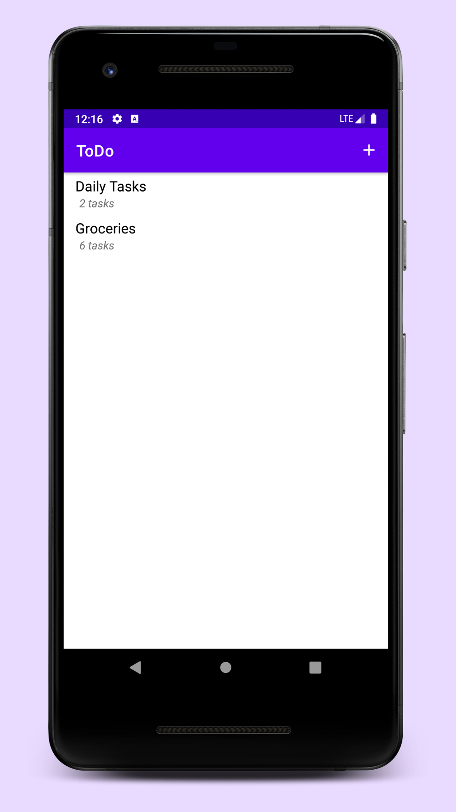
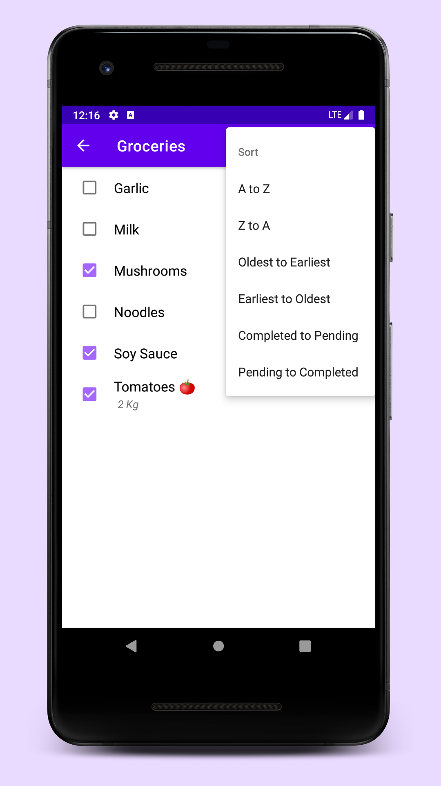
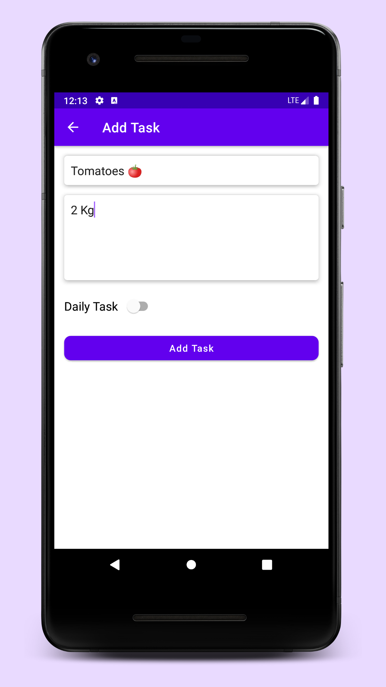
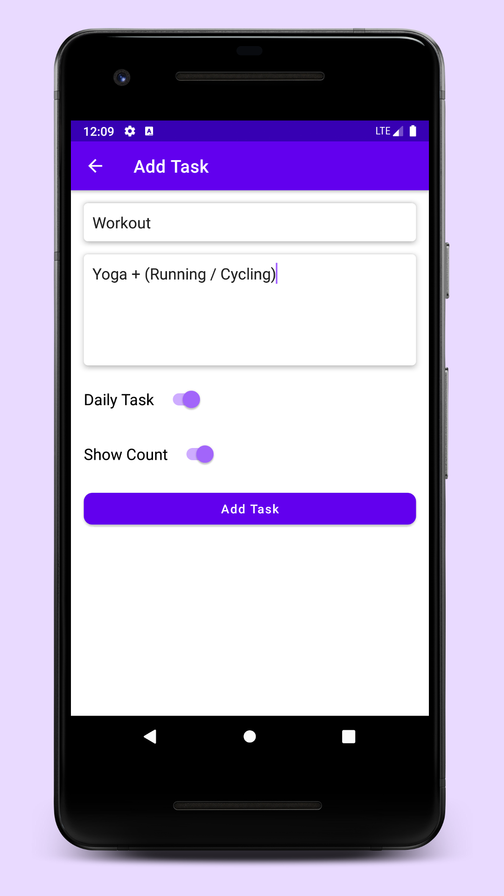
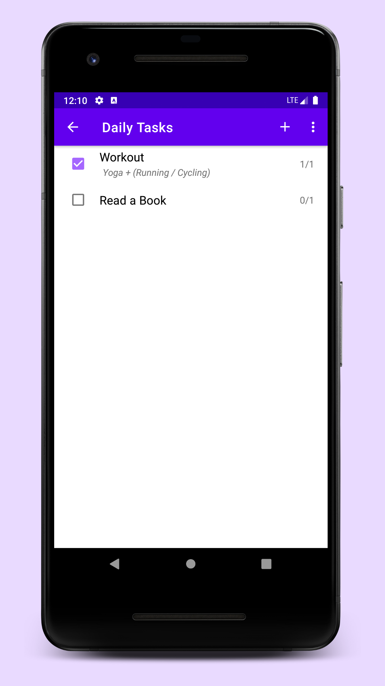
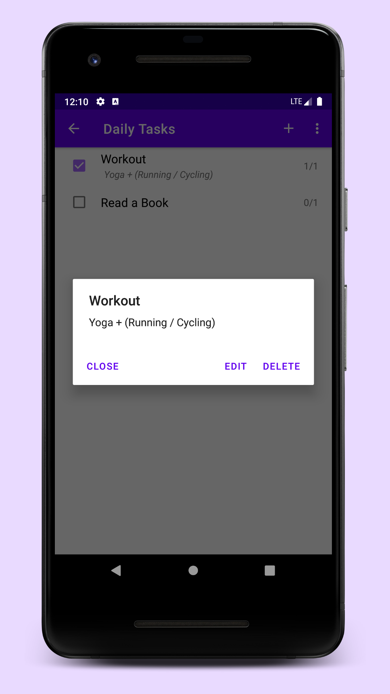
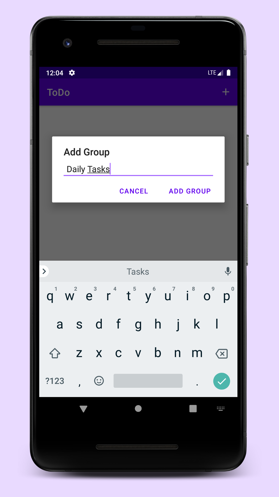

# ToDo

----

<table>
    <tr>
        <th>Title</th>
        <td> ToDo </td>
    </tr>
    <tr>
        <th>Short description</th>
        <td>ToDo, helps you manage and achieve your goals.</td>
    </tr>
    <tr>
        <th>Full description</th>
        <td>Create Daily Tasks or single time tasks. Track how you are performing on your daily tasks. Separate your tasks into groups to organize and manage them properly. This is an open source application, you can find its source code on GitHub at https://github.com/kashew-developers/todo</td>
    </tr>
</table>

----

#### Screenshots

<table>
    <tr>
        <td></td>
        <td></td>
        <td></td>
        <td></td>
    </tr>
    <tr>
        <td></td>
        <td></td>
        <td></td>
    </tr>
</table>
